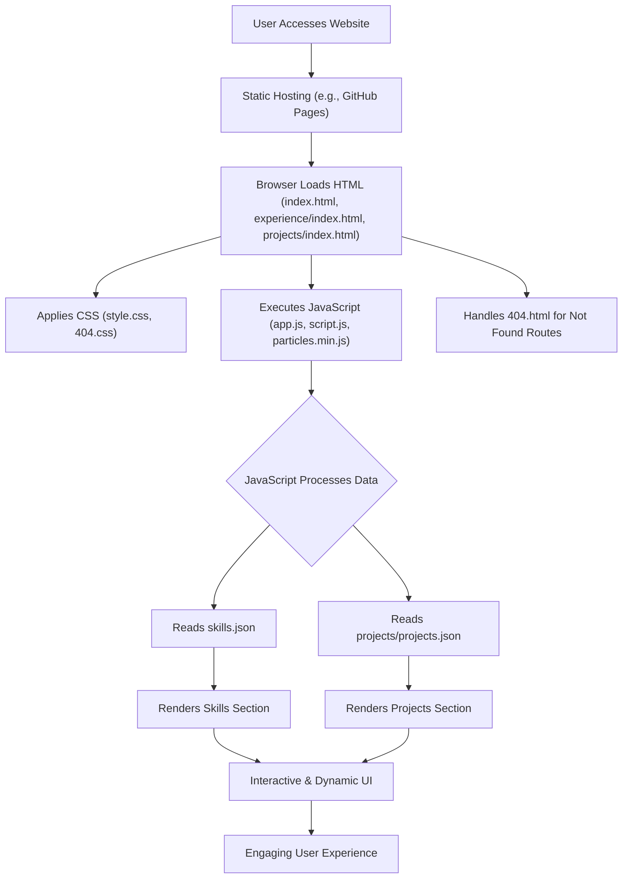

# 🚀 Dynamic Portfolio Website

<p align="center"></p>

## Short Description
Showcase your professional journey, skills, and projects with this highly customizable and visually stunning personal portfolio website. Built with a focus on modern web standards and user experience, it's designed to make a lasting impression on recruiters, potential clients, and collaborators.

## ✨ Key Features
*   **Elegant & Responsive Design:** A sleek, modern user interface that adapts flawlessly to any screen size, ensuring an optimal viewing experience across all devices.
*   **Interactive UI/UX:** Engage visitors with dynamic elements, smooth transitions, and captivating background effects powered by `particles.min.js`.
*   **Comprehensive Sections:** Dedicated pages for your `Experience`, `Projects`, and `Skills`, offering a complete overview of your professional profile.
*   **Automated Deployment:** Streamlined development and deployment with GitHub Actions CI/CD pipeline, ensuring your latest updates are always live.
*   **Custom 404 Page:** A branded and user-friendly 404 page for a polished error handling experience.
*   **Downloadable Resume:** Easily provide your full resume in PDF format (`assests/resume.pdf`) for quick access.
*   **Data-Driven Content:** Skills and projects are managed via `skills.json` and `projects/projects.json`, making content updates simple and efficient.

## Who is this for?
This project is ideal for:
*   **Software Developers & Engineers** seeking to present their work professionally.
*   **Designers & Creatives** wanting a clean canvas to display their visual portfolios.
*   **Students & Freelancers** aiming to build an online presence and attract opportunities.
*   Anyone looking for a **modern, easily deployable, and impactful personal website**.

## Technology Stack & Architecture
This portfolio is a lean, high-performance static website leveraging fundamental web technologies:

*   **Frontend:** HTML5, CSS3, JavaScript (Vanilla JS, `particles.min.js` for animations).
*   **Styling:** Custom CSS (`assests/css/style.css`, `assests/css/404.css`).
*   **Scripting:** Custom JavaScript (`assests/js/app.js`, `assests/js/script.js`, `assests/js/404.js`).
*   **Data Storage:** JSON files (`skills.json`, `projects/projects.json`) for dynamic content.
*   **Deployment:** GitHub Actions (`.github/workflows/ci-cd.yml`) for continuous integration and deployment.

## 📊 Architecture & Database Schema

This project follows a client-side, static site architecture. There's no traditional backend database; data is loaded directly from JSON files.



## ⚡ Quick Start Guide

To get your personal portfolio up and running, follow these simple steps:

1.  **Clone the Repository:**
    ```bash
    git clone https://github.com/Omkar0940/portfolio_website.git
    cd portfolio_website
    ```

2.  **Open in Browser:**
    Simply open the `index.html` file in your preferred web browser.
    ```bash
    # On macOS/Linux
    open index.html
    # On Windows
    start index.html
    ```

3.  **Customize Your Content:**
    *   Edit `skills.json` to update your technical proficiencies.
    *   Modify `projects/projects.json` to showcase your latest work.
    *   Update `assests/resume.pdf` with your current resume.
    *   Personalize `index.html`, `experience/index.html`, and `projects/index.html` with your details and narrative.

4.  **Deploy (Optional, but recommended):**
    This project is set up for easy deployment using GitHub Pages via GitHub Actions. Push your changes to the `main` branch, and the CI/CD pipeline will handle the rest!

## 📜 License
This project is open-sourced under the [MIT License](LICENSE).