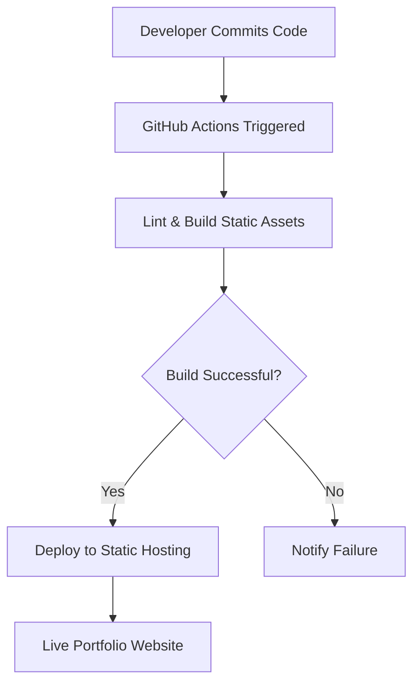

# 🚀 Omkar0940's Dynamic Portfolio

<p align="center"></p>

## Short Description
Unveiling a highly interactive and aesthetically driven personal portfolio website designed to captivate and inform. This project meticulously showcases Omkar0940's skills, experience, and projects through a responsive and engaging user interface, powered by robust web technologies and streamlined with modern CI/CD practices.

## ✨ Key Features
*   **Immersive User Experience:** Dynamic layouts, engaging animations, and interactive elements ensure a memorable visit.
*   **Responsive & Adaptive Design:** Flawless presentation across all devices, from desktops to mobile phones.
*   **Comprehensive Portfolio Showcase:** Dedicated sections for detailed projects, professional experience, and technical skills.
*   **Effortless Resume Access:** A direct link to download the developer's resume for quick review.
*   **Automated Deployment Pipeline:** Leverages GitHub Actions for continuous integration and continuous delivery, ensuring swift and reliable updates.
*   **Custom 404 Page:** A branded and user-friendly page for handling unexpected navigation, enhancing overall site professionalism.
*   **Modern Frontend Stack:** Built with a strong foundation in HTML5, CSS3, and JavaScript, enhanced with `particles.js` for visual flair.

## Who is this for?
This portfolio is tailored for:
*   **Prospective Employers:** Seeking a clear, concise, and compelling overview of a developer's capabilities and work ethic.
*   **Potential Collaborators:** Interested in understanding technical strengths and project involvement opportunities.
*   **Recruiters & Hiring Managers:** Looking for a modern, well-structured representation of professional experience and technical prowess.
*   **Anyone Inspired by Web Development:** Curious to see a practical application of best practices in frontend design and deployment.

## Technology Stack & Architecture
This project is built with a focused, modern frontend stack designed for performance and maintainability.

*   **Frontend Technologies:**
    *   **HTML5:** For semantic and structured content.
    *   **CSS3:** Custom stylesheets (`style.css`, `404.css`) for sophisticated styling and responsive design.
    *   **JavaScript:** Vanilla JS (`script.js`, `app.js`, `404.js`) for interactivity and dynamic content.
    *   **Particles.js:** A lightweight JavaScript library used to create engaging particle animations.
*   **Deployment & Automation:**
    *   **GitHub Actions:** For implementing Continuous Integration and Continuous Delivery (CI/CD), automating build and deployment processes.
*   **Version Control:**
    *   **Git:** For efficient source code management and collaboration.

## 📊 Architecture & Database Schema
As a static portfolio website, this project does not incorporate a backend database. Its architecture focuses on a robust frontend delivery pipeline. The system ensures that every update is seamlessly processed and deployed through an automated workflow.



## ⚡ Quick Start Guide
Getting this portfolio website up and running locally is incredibly simple. Follow these steps:

1.  **Clone the Repository:**
    ```bash
    git clone https://github.com/Omkar0940/portfolio_website.git
    ```
2.  **Navigate to the Project Directory:**
    ```bash
    cd portfolio_website
    ```
3.  **Open in Your Browser:**
    Simply open the `index.html` file located in the root of the project directory with your preferred web browser. No server setup is required for local viewing!

## 📜 License
This project is open-sourced under the MIT License. See the `LICENSE` file for more details.